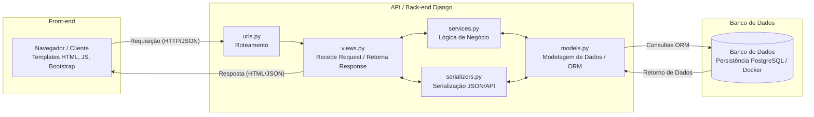
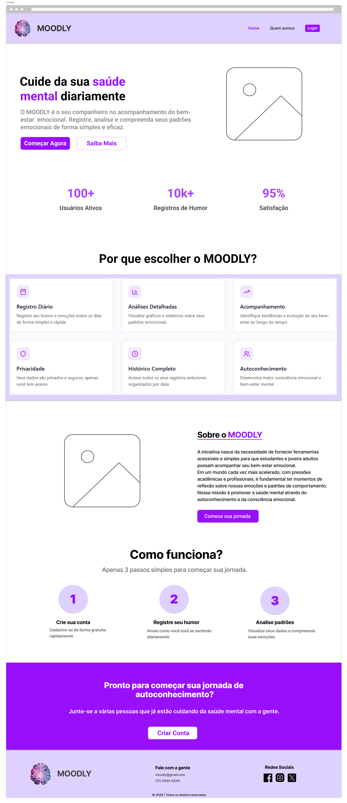
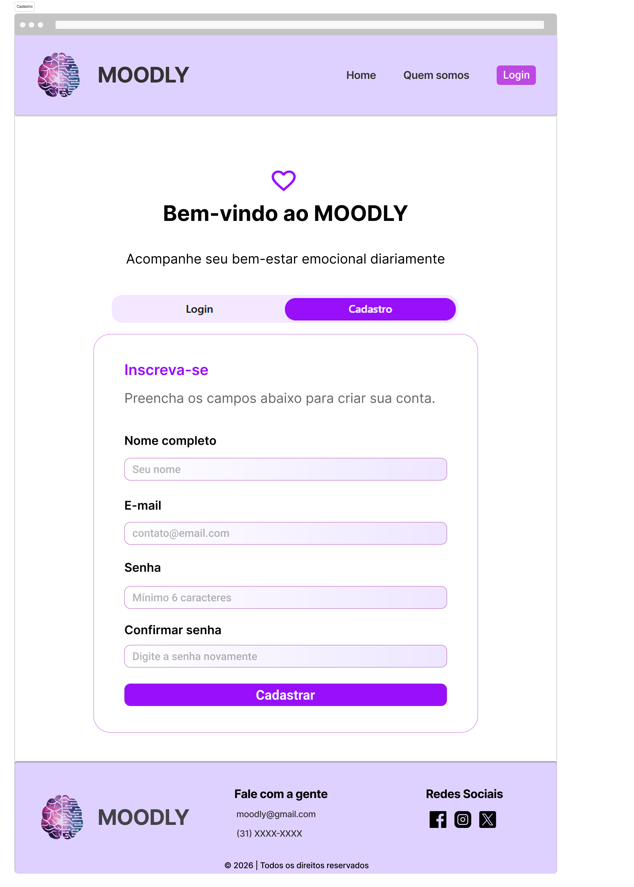
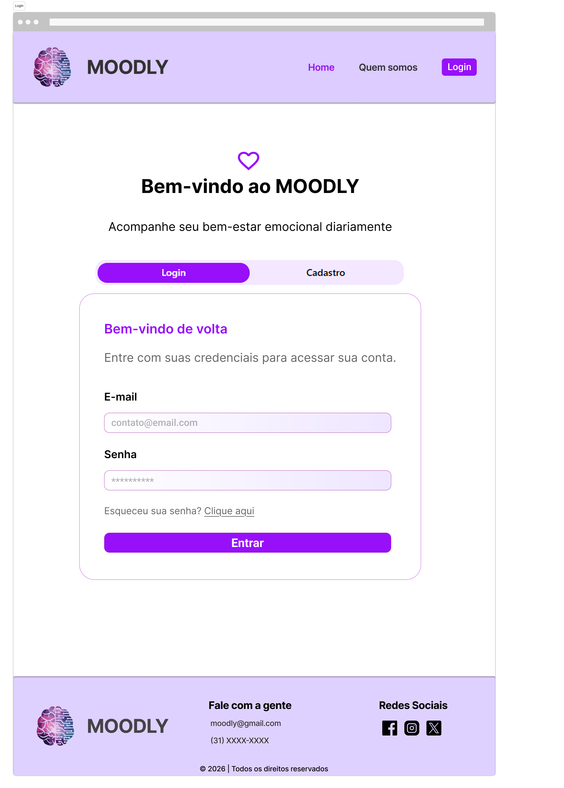
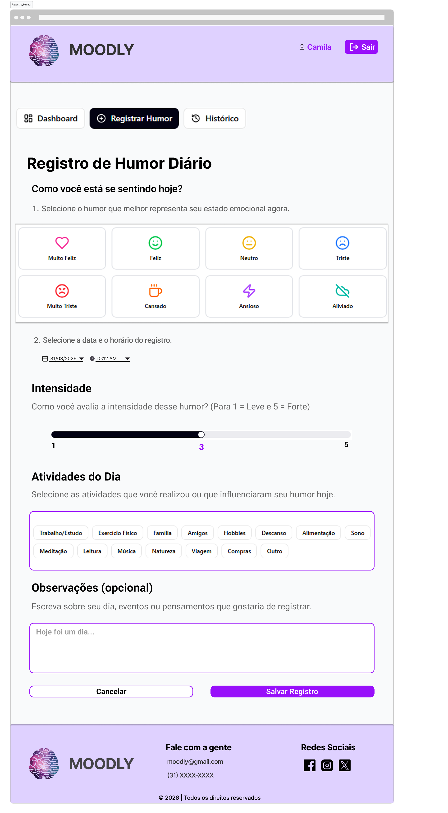

# 4. Projeto da Solução

> Aviso aos Squads (Software House)
>
> Esta seção não deve ser preenchida integralmente antes da codificação.
> Trata-se de um Documento Vivo, que deverá ser atualizado incrementalmente a cada Sprint, refletindo fielmente o código real implementado.

---

## 4.1 Arquitetura da Solução (Sprint 1 e 2)

Apresente um diagrama macro demonstrando como os componentes do sistema se comunicam.

A arquitetura deve refletir o modelo de fatias verticais, evidenciando o fluxo:

Front-end -> API (Back-end) -> Banco de Dados

Semelhante à imagem abaixo:


Fonte: [Guia Completo de Desenvolvimento de Software - UDS](https://uds.com.br/blog/desenvolvimento-de-software-guia-completo/) <br><br>
 
### Inserir o Diagrama de Arquitetura do Projeto do Grupo

Abaixo está o fluxo da aplicação, demonstrando a comunicação entre o Front-end, a API (Back-end) e o Banco de Dados.



---
Ferramentas recomendadas:
- Draw.io
- Lucidchart
- Figma

---

## 4.2 Tecnologias Utilizadas (Sprint 1 e 2)

Descreva as tecnologias, linguagens, frameworks, bibliotecas e serviços escolhidos pelo Squad.

| Dimensão | Tecnologia Escolhida |
|----------|----------------------|
| Banco de Dados (SGBD) | PostgreSQL (Conteinerizado via Docker) |
| Back-end (API) | Python com Django e Django REST Framework |
| Front-end / Mobile | HTML5, CSS3, JavaScript e Bootstrap |
| Hospedagem / Deploy | A definir nas próximas sprints |
| Gestão e Versionamento | GitHub e Git |

 Observação:
 - GitHub Pages não executa back-end.
 - Utilize apenas tecnologias realmente implementadas.

---

##  4.3 Wireframes ou Mockups (A partir da Sprint 2)

Apresente os protótipos das telas (Wireframes/Mockups) apenas das funcionalidades que estão sendo implementadas na Sprint atual.

Cada Wireframe ou Mockups devem estar associados a pelo menos:

- Um Requisito Funcional (RF-XX)
- Uma História de Usuário
  
## Wireframes/ Mockups do Projeto de Software

### Tela Inicial

Representação do Wireframe:



### Tela de Cadastro (RF-01)

História associada: Como usuário, eu quero criar uma conta para que eu possa acessar o sistema de forma segura.

Representação do Wireframe:



Descrição: Possibilita ao usuário criar uma nova conta informando nome, e-mail e senha. Após o cadastro realizado com sucesso, o usuário pode acessar o sistema utilizando suas credenciais.

### Tela de Login (RF-02)

História associada: Como usuário, eu quero realizar login com meu e-mail e senha para que eu possa acessar meus registros de humor.

Representação do Wireframe:



Descrição: Permite que o usuário acesse ao sistema por meio do preenchimento dos campos de e-mail e senha, com validação dos dados inseridos e envio das credenciais para autenticação.

### Tela de Registro de Humor Diário (RF-03)

História associada: Como usuário, eu quero registrar meu humor diariamente para que eu possar compreender meu estado emocional ao longo do tempo.

Representação do Wireframe:



Descrição: A tela de registro de humor permite registrar o humor diário com validação no backend e persistência dos dados no banco, contemplando o RF-03.

---

Ferramenta utilizada:

- Figma
   
---

## 4.4 Modelagem de Dados (Sprint 2 e 3)

O sistema exige persistência de dados.

A documentação do banco seguirá a abordagem de entrega contínua, sendo expandida conforme evolução do projeto.

---

### 4.4.1 Script Físico (Entrega na Sprint 2 - MVP)

Para a primeira fatia vertical (MVP), o Squad deverá entregar o script de criação das tabelas ou coleções utilizadas.

Para Banco Relacional (SQL)

Incluir:

- Comandos CREATE TABLE
- Definição de chave primária (PK)
- Definição de chaves estrangeiras (FK)

Script Implementado (PostgreSQL via Docker):

```sql
CREATE TABLE "auth_user" (
    "id" integer NOT NULL PRIMARY KEY GENERATED BY DEFAULT AS IDENTITY,
    "password" varchar(128) NOT NULL,
    "last_login" timestamp with time zone NULL,
    "is_superuser" boolean NOT NULL,
    "username" varchar(150) NOT NULL UNIQUE,
    "first_name" varchar(150) NOT NULL,
    "last_name" varchar(150) NOT NULL,
    "email" varchar(254) NOT NULL,
    "is_staff" boolean NOT NULL,
    "is_active" boolean NOT NULL,
    "date_joined" timestamp with time zone NOT NULL
);

CREATE TABLE "core_moodentry" (
    "id" bigint NOT NULL PRIMARY KEY GENERATED BY DEFAULT AS IDENTITY,
    "emotion" varchar(20) NOT NULL,
    "intensity_level" integer NOT NULL,
    "notes" text NULL,
    "created_at" timestamp with time zone NOT NULL,
    "user_id" integer NOT NULL,
    CONSTRAINT "core_moodentry_user_id_fk" FOREIGN KEY ("user_id") REFERENCES "auth_user" ("id") DEFERRABLE INITIALLY DEFERRED
);
```

---

Para Banco NoSQL

Incluir a estrutura dos documentos JSON (Schema).

Exemplo:

```json
{
  "nome": "João Silva",
  "email": "joao@email.com",
  "senha": "hash_da_senha"
}
```

### Obrigatório

O arquivo .sql ou .js deve ser salvo na pasta: src/bd

 - É permitido colar um trecho do script no README apenas para visualização rápida.
 
---
### 4.4.2 Representação do Modelo Físico de Dados (Entrega na Sprint 3 - Core)


> Fundamentação: Os modelos de dados físicos fornecem detalhes minuciosos que auxiliam administradores e desenvolvedores na implementação da lógica de negócios em um banco de dados real.
> Eles incluem elementos não especificados no modelo lógico, como:
> - Tipos de dados específicos da plataforma
> - Restrições
> - Índices
> - Triggers (quando aplicável)
> - Procedimentos armazenados (quando aplicável)
>
>Por representarem um banco real, devem respeitar:
> - Convenções de nomenclatura
> - Restrições da plataforma
> - Uso adequado de palavras reservadas <br>


Exemplo:


FONTE: [https://aws.amazon.com/pt/compare/the-difference-between-logical-and-physical-data-model/](https://aws.amazon.com/pt/compare/the-difference-between-logical-and-physical-data-model/)

<br>O grupo deverá gerar um diagrama físico do banco de dados (estrutura real das tabelas), evidenciando PKs, FKs e relacionamentos, conforme implementado no código.

Este modelo deve exibir:
- Tabelas ou coleções existentes
- Atributos com seus respectivos tipos de dados
- Chaves Primárias (PK)
- Chaves Estrangeiras (FK)
- Relacionamentos entre tabelas
- Restrições implementadas (quando aplicável)

---

### Requisitos Obrigatórios

- O diagrama deve representar fielmente o banco já implementado.
- Deve refletir exatamente o que foi criado nas Sprints 2 e 3.
- Não incluir tabelas que não existam no código.
- Deve contemplar o controle de acesso de usuários, quando implementado.
- Deve respeitar as convenções e restrições da plataforma utilizada.

---

### Representação do Modelo Físico de Dados
O grupo deverá inserir aqui a imagem do diagrama físico de dados.

---
Ferramentas Sugeridas
- MySQL Workbench (engenharia reversa automática)
- DbDesigner
- Lucidchart