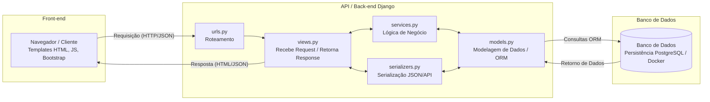
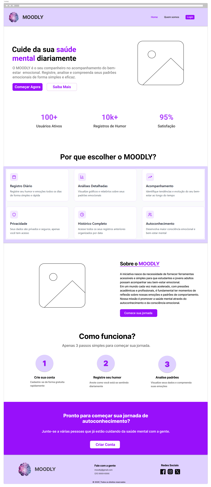
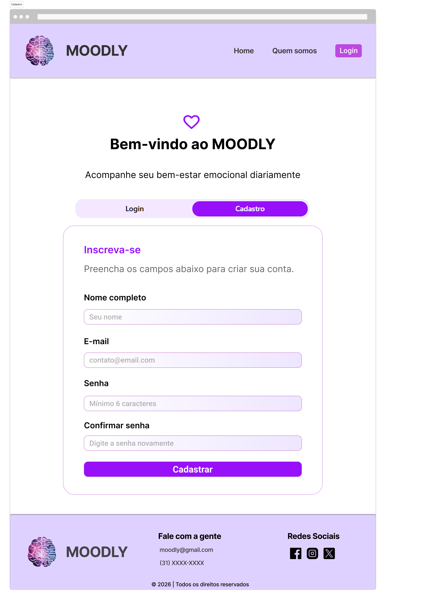
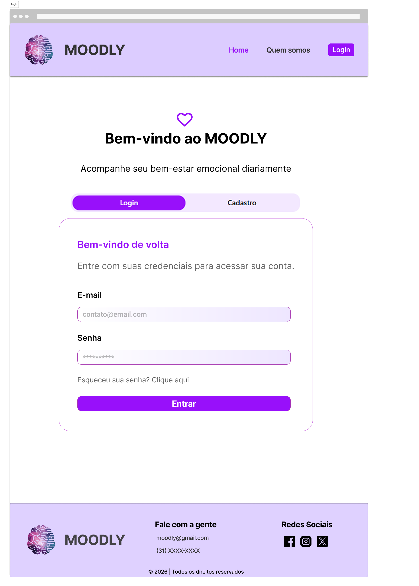
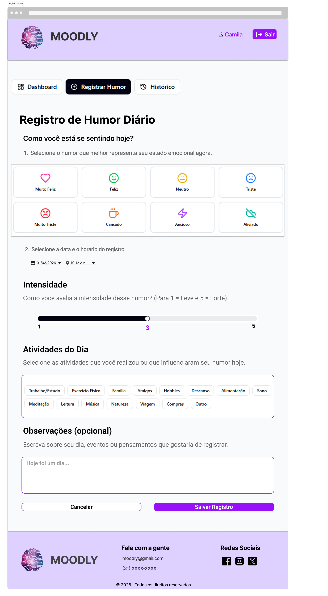

# 4. Projeto da Solução

## 4.1 Arquitetura da Solução (Sprint 1 e 2)

Diagrama macro que demonstra como os componentes do sistema se comunicam.

A arquitetura reflete o modelo de fatias verticais, evidenciando o fluxo:

Front-end -> API (Back-end) -> Banco de Dados
 
### Diagrama de Arquitetura do Projeto 

Abaixo está o fluxo da aplicação, demonstrando a comunicação entre o Front-end, a API (Back-end) e o Banco de Dados.


```mermaid
flowchart LR
    subgraph Front-End [Front-end]
        UI[Navegador / Cliente<br/>Templates HTML, JS, Bootstrap]
    end

    subgraph API_Django [API / Back-end Django]
        direction TB
        URL[urls.py<br/>Roteamento]
        VIEW[views.py<br/>Recebe Request / Retorna Response]
        SERVICE[services.py<br/>Lógica de Negócio]
        SERIAL[serializers.py<br/>Serialização JSON/API]
        MODEL[models.py<br/>Modelagem de Dados / ORM]

        URL --> VIEW
        VIEW <--> SERIAL
        VIEW <--> SERVICE
        SERVICE <--> MODEL
        SERIAL <--> MODEL
    end

    subgraph BD [Banco de Dados]
        DB[(Banco de Dados<br/>Persistência PostgreSQL / Docker)]
    end

    UI -- "Requisição (HTTP/JSON)" --> URL
    VIEW -- "Resposta (HTML/JSON)" --> UI
    MODEL -- "Consultas ORM" --> DB
    DB -- "Retorno de Dados" --> MODEL
```

---
Ferramentas recomendadas:
- Draw.io
- Lucidchart
- Figma

---

## 4.2 Tecnologias Utilizadas (Sprint 1 e 2)

Tecnologias, linguagens, frameworks, bibliotecas e serviços escolhidos pelo Squad.

| Dimensão | Tecnologia Escolhida |
|----------|----------------------|
| Banco de Dados (SGBD) | PostgreSQL (Conteinerizado via Docker) |
| Back-end (API) | Python com Django e Django REST Framework |
| Front-end / Mobile | HTML5, CSS3, JavaScript e Bootstrap |
| Hospedagem / Deploy | A definir nas próximas sprints |
| Gestão e Versionamento | GitHub e Git |

 Observação:
 - GitHub Pages não executa back-end.
 - Utilize apenas tecnologias realmente implementadas.

---

##  4.3 Wireframes ou Mockups (A partir da Sprint 2)

Protótipos das telas (Wireframes/Mockups) das funcionalidades que estão sendo implementadas na Sprint atual.

Cada Wireframe ou Mockups devem estar associados a pelo menos:

- Um Requisito Funcional (RF-XX)
- Uma História de Usuário
  
## Wireframes/ Mockups do Projeto de Software

### Tela Inicial

Representação do Wireframe:



### Tela de Cadastro (RF-01)

História associada: Como usuário, eu quero criar uma conta para que eu possa acessar o sistema de forma segura.

Representação do Wireframe:



Descrição: Possibilita ao usuário criar uma nova conta informando nome, e-mail e senha. Após o cadastro realizado com sucesso, o usuário pode acessar o sistema utilizando suas credenciais.

### Tela de Login (RF-02)

História associada: Como usuário, eu quero realizar login com meu e-mail e senha para que eu possa acessar meus registros de humor.

Representação do Wireframe:



Descrição: Permite que o usuário acesse ao sistema por meio do preenchimento dos campos de e-mail e senha, com validação dos dados inseridos e envio das credenciais para autenticação.

### Tela de Registro de Humor Diário (RF-03)

História associada: Como usuário, eu quero registrar meu humor diariamente para que eu possar compreender meu estado emocional ao longo do tempo.

Representação do Wireframe:



Descrição: A tela de registro de humor permite registrar o humor diário com validação no backend e persistência dos dados no banco, contemplando o RF-03.

---

Ferramenta utilizada:

- Figma
   
---

## 4.4 Modelagem de Dados (Sprint 2 e 3)

O sistema exige persistência de dados.

A documentação do banco seguirá a abordagem de entrega contínua, sendo expandida conforme evolução do projeto.

---

### 4.4.1 Script Físico (Entrega na Sprint 2 - MVP)

Para a primeira fatia vertical (MVP), o Squad deverá entregar o script de criação das tabelas ou coleções utilizadas.

Para Banco Relacional (SQL)

Incluir:

- Comandos CREATE TABLE
- Definição de chave primária (PK)
- Definição de chaves estrangeiras (FK)

Script Implementado (PostgreSQL via Docker):

```sql
CREATE TABLE "auth_user" (
    "id" integer NOT NULL PRIMARY KEY GENERATED BY DEFAULT AS IDENTITY,
    "password" varchar(128) NOT NULL,
    "last_login" timestamp with time zone NULL,
    "is_superuser" boolean NOT NULL,
    "username" varchar(150) NOT NULL UNIQUE,
    "first_name" varchar(150) NOT NULL,
    "last_name" varchar(150) NOT NULL,
    "email" varchar(254) NOT NULL,
    "is_staff" boolean NOT NULL,
    "is_active" boolean NOT NULL,
    "date_joined" timestamp with time zone NOT NULL
);

CREATE TABLE "core_moodentry" (
    "id" bigint NOT NULL PRIMARY KEY GENERATED BY DEFAULT AS IDENTITY,
    "emotion" varchar(20) NOT NULL,
    "intensity_level" integer NOT NULL,
    "notes" text NULL,
    "created_at" timestamp with time zone NOT NULL,
    "user_id" integer NOT NULL,
    CONSTRAINT "core_moodentry_user_id_fk" FOREIGN KEY ("user_id") REFERENCES "auth_user" ("id") DEFERRABLE INITIALLY DEFERRED
);
```

---

### Obrigatório

O arquivo .sql ou .js deve ser salvo na pasta: src/bd

 - É permitido colar um trecho do script no README apenas para visualização rápida.
 
---

### 4.4.2 Representação do Modelo Físico de Dados (Entrega na Sprint 3 - Core)

> Fundamentação: Os modelos de dados físicos fornecem detalhes minuciosos que auxiliam administradores e desenvolvedores na implementação da lógica de negócios em um banco de dados real.
> Eles incluem elementos não especificados no modelo lógico, como:
> - Tipos de dados específicos da plataforma
> - Restrições
> - Índices
> - Triggers (quando aplicável)
> - Procedimentos armazenados (quando aplicável)
>
>Por representarem um banco real, devem respeitar:
> - Convenções de nomenclatura
> - Restrições da plataforma
> - Uso adequado de palavras reservadas <br>

---

### Requisitos Obrigatórios

- O diagrama deve representar fielmente o banco já implementado.
- Deve refletir exatamente o que foi criado nas Sprints 2 e 3.
- Não incluir tabelas que não existam no código.
- Deve contemplar o controle de acesso de usuários, quando implementado.
- Deve respeitar as convenções e restrições da plataforma utilizada.

---

### Representação do Modelo Físico de Dados (Implementado)

#### Diagrama Entidade-Relacionamento (MER)

O sistema está organizado em torno de 2 entidades principais:

```
┌─────────────────────────────────────────────────────────────────┐
│                          MODELO FÍSICO                          │
│                      (PostgreSQL via Docker)                    │
└─────────────────────────────────────────────────────────────────┘


┌────────────────────────────────┐
│      auth_user (Django)        │
├────────────────────────────────┤
│ id (PK)                        │
│ username (UNIQUE, VARCHAR 150) │
│ email (UNIQUE, VARCHAR 254)    │
│ password (VARCHAR 128 - hash)  │
│ first_name (VARCHAR 150)       │
│ last_name (VARCHAR 150)        │
│ is_staff (BOOLEAN)             │
│ is_active (BOOLEAN)            │
│ is_superuser (BOOLEAN)         │
│ last_login (TIMESTAMP NULL)    │
│ date_joined (TIMESTAMP)        │
└────────────────────────────────┘
          ▲
          │ 1:N
          │ (Um usuário pode ter vários registros)
          │
┌─────────────────────────────────────────────────────────────┐
│           core_moodentry                                    │
├─────────────────────────────────────────────────────────────┤
│ id (PK)                                                     │
│ user_id (FK → auth_user.id) - NOT NULL                     │
│ emotion (VARCHAR 20) - CHOICES                             │
│   • MUITO_FELIZ / FELIZ / NEUTRO / TRISTE                  │
│   • MUITO_TRISTE / CANSADO / ANSIOSO / ALIVIADO            │
│ intensity_level (INTEGER) - CHECK (1-10)                   │
│ notes (TEXT) - NULL                                        │
│ created_at (TIMESTAMP) - auto_now_add                      │
│ updated_at (TIMESTAMP) - auto_now                          │
└─────────────────────────────────────────────────────────────┘
```

#### Script SQL (DDL PostgreSQL)

```sql
-- Tabela: auth_user (fornecida pelo Django)
CREATE TABLE "auth_user" (
    "id" integer NOT NULL PRIMARY KEY GENERATED BY DEFAULT AS IDENTITY,
    "password" varchar(128) NOT NULL,
    "last_login" timestamp with time zone NULL,
    "is_superuser" boolean NOT NULL,
    "username" varchar(150) NOT NULL UNIQUE,
    "first_name" varchar(150) NOT NULL,
    "last_name" varchar(150) NOT NULL,
    "email" varchar(254) NOT NULL UNIQUE,
    "is_staff" boolean NOT NULL,
    "is_active" boolean NOT NULL,
    "date_joined" timestamp with time zone NOT NULL
);

-- Tabela: core_moodentry
CREATE TABLE "core_moodentry" (
    "id" bigint NOT NULL PRIMARY KEY GENERATED BY DEFAULT AS IDENTITY,
    "emotion" varchar(20) NOT NULL,
    "intensity_level" integer NOT NULL,
    "notes" text NULL,
    "created_at" timestamp with time zone NOT NULL,
    "updated_at" timestamp with time zone NOT NULL,
    "user_id" integer NOT NULL,
    CONSTRAINT "ck_intensity_level" 
        CHECK (intensity_level >= 1 AND intensity_level <= 10),
    CONSTRAINT "ck_emotion" 
        CHECK (emotion IN ('MUITO_FELIZ', 'FELIZ', 'NEUTRO', 'TRISTE', 
                           'MUITO_TRISTE', 'CANSADO', 'ANSIOSO', 'ALIVIADO')),
    CONSTRAINT "core_moodentry_user_id_fk" 
        FOREIGN KEY ("user_id") REFERENCES "auth_user" ("id") 
        ON DELETE CASCADE DEFERRABLE INITIALLY DEFERRED
);

-- Índices para performance
CREATE INDEX "idx_core_moodentry_user_id" ON "core_moodentry"("user_id");
CREATE INDEX "idx_core_moodentry_created_at" ON "core_moodentry"("created_at" DESC);
CREATE INDEX "idx_core_moodentry_user_created" ON "core_moodentry"("user_id", "created_at" DESC);
```

---

### Diagrama de Classes (UML)

#### Estrutura de Classes (Engenharia Reversa do Código)

```
┌────────────────────────────────────────────────────────────────┐
│                   <<model>> User (Django)                      │
├────────────────────────────────────────────────────────────────┤
│ Attributes:                                                    │
│  - id: int (PK)                                                │
│  - username: str (unique)                                      │
│  - email: str (unique)                                         │
│  - password: str (hashed PBKDF2+SHA256)                        │
│  - first_name: str                                             │
│  - is_active: bool = True                                      │
│  - date_joined: datetime (auto)                                │
├────────────────────────────────────────────────────────────────┤
│ Methods (via Django):                                          │
│  + set_password(raw_password: str): void                       │
│  + check_password(raw_password: str): bool                     │
│  + __str__(): str                                              │
└────────────────────────────────────────────────────────────────┘
        ▲
        │ 1:N Relationship
        │ "has_many :mood_entries"
        │
        │
┌────────────────────────────────────────────────────────────────┐
│               <<model>> MoodEntry                              │
├────────────────────────────────────────────────────────────────┤
│ Attributes:                                                    │
│  - id: int (PK)                                                │
│  - user: ForeignKey → User (NOT NULL)                          │
│  - emotion: str (CHOICES)                                      │
│    • MUITO_FELIZ / FELIZ / NEUTRO / TRISTE                    │
│    • MUITO_TRISTE / CANSADO / ANSIOSO / ALIVIADO              │
│  - intensity_level: int (range: 1-10) ✓ Validated             │
│  - notes: str (max 500, nullable)                              │
│  - created_at: datetime (auto_now_add)                         │
│  - updated_at: datetime (auto_now)                             │
├────────────────────────────────────────────────────────────────┤
│ Methods:                                                       │
│  + __str__(): str                                              │
│    → Format: "{user} - {emotion} ({intensity}/10) on {date}"   │
│                                                                │
│ Inner Class:                                                   │
│  + Emotion (TextChoices)                                       │
│    - MUITO_FELIZ = "MUITO_FELIZ", "Muito Feliz"               │
│    - FELIZ = "FELIZ", "Feliz"                                  │
│    - ... (8 options total)                                     │
│                                                                │
│ Manager:                                                       │
│  + objects: MoodEntryQuerySet.as_manager()                     │
│                                                                │
│ Meta:                                                          │
│  - ordering: ["-created_at"]                                   │
│  - indexes: user_id, created_at, (user_id, created_at)       │
└────────────────────────────────────────────────────────────────┘


┌────────────────────────────────────────────────────────────────┐
│           <<queryset>> MoodEntryQuerySet                       │
├────────────────────────────────────────────────────────────────┤
│ Methods:                                                       │
│  + for_user(user: User): QuerySet                              │
│    → Filters: user=user                                        │
│  + in_period(date_from, date_to): QuerySet                     │
│    → Filters by date range if provided                         │
│  + recent(limit: int = 20): QuerySet                           │
│    → Returns last N records ordered by date DESC               │
└────────────────────────────────────────────────────────────────┘
        ▲
        │ used_by
        │
┌────────────────────────────────────────────────────────────────┐
│           <<service>> MoodEntryService                         │
├────────────────────────────────────────────────────────────────┤
│ Static Methods:                                                │
│  + get_user_entries(user, date_from=None, date_to=None,       │
│                     limit=20): QuerySet[MoodEntry]            │
│  + create_entry(user, form): MoodEntry                         │
│  + update_entry(entry, form): MoodEntry                        │
│  + delete_entry(entry): void                                   │
└────────────────────────────────────────────────────────────────┘
        ▲
        │ called_by
        │
┌────────────────────────────────────────────────────────────────┐
│                    <<view>> Views                              │
├────────────────────────────────────────────────────────────────┤
│ Functions:                                                     │
│  + index(request): HttpResponse                                │
│  + register_view(request): HttpResponse                        │
│  + dashboard_view(request): HttpResponse [@login_required]    │
│  + create_entry_view(request): HttpResponse [@login_required] │
│  + edit_entry_view(request, pk): HttpResponse [@login_required│
│  + delete_entry_view(request, pk): HttpResponse [@login_req]  │
│  + dashboard_graphs(request): HttpResponse [@login_required]  │
└────────────────────────────────────────────────────────────────┘
```

#### Arquitetura em Camadas (N-Tier)

```
┌─────────────────────────────────────────────────────────────┐
│     PRESENTATION LAYER (Templates HTML + Bootstrap)         │
│  ├─ home.html                                               │
│  ├─ login.html / registration.html                          │
│  ├─ dashboard.html (visualizar registros)                   │
│  ├─ create_entry.html                                       │
│  ├─ edit_entry.html                                         │
│  ├─ delete_entry.html (confirmação)                         │
│  └─ dashboard_graphs.html (gráficos via Chart.js)           │
└──────────────────▲──────────────────────────────────────────┘
                   │ render()
┌──────────────────┴──────────────────────────────────────────┐
│     APPLICATION LAYER (Django Views)                        │
│  ├─ index()          → render home                          │
│  ├─ register_view()  → create user                          │
│  ├─ dashboard_view() → list entries                         │
│  ├─ create_entry_view() → POST new mood                     │
│  ├─ edit_entry_view()   → PUT/POST update                   │
│  ├─ delete_entry_view() → DELETE confirmation               │
│  └─ dashboard_graphs()  → render graphs                     │
└──────────────────▲──────────────────────────────────────────┘
                   │ call()
┌──────────────────┴──────────────────────────────────────────┐
│   BUSINESS LOGIC LAYER (Services + QuerySets)              │
│  ├─ MoodEntryService (encapsula lógica)                     │
│  │  ├─ get_user_entries()                                   │
│  │  ├─ create_entry()                                       │
│  │  ├─ update_entry()                                       │
│  │  └─ delete_entry()                                       │
│  └─ MoodEntryQuerySet (queries reutilizáveis)              │
│     ├─ for_user()                                           │
│     ├─ in_period()                                          │
│     └─ recent()                                             │
└──────────────────▲──────────────────────────────────────────┘
                   │ query()
┌──────────────────┴──────────────────────────────────────────┐
│   DATA ACCESS LAYER (ORM Models)                            │
│  ├─ User (Django Auth)                                      │
│  └─ MoodEntry                                               │
│     └─ Managers: objects.for_user(), recent(), ...          │
└──────────────────▲──────────────────────────────────────────┘
                   │ SQL
┌──────────────────┴──────────────────────────────────────────┐
│     DATABASE LAYER (PostgreSQL)                             │
│  ├─ auth_user (table)                                       │
│  └─ core_moodentry (table)                                  │
│     └─ Indexes, constraints, triggers                       │
└─────────────────────────────────────────────────────────────┘
```

---

### Matriz de Rastreabilidade (Requisitos ↔ Componentes)

| Requisito | Modelo | View | Service | QuerySet | Template |
|-----------|--------|------|---------|----------|----------|
| RF-01 (Registrar) | - | register_view | - | - | registration/login.html |
| RF-02 (Login) | User (Django Auth) | Django Auth | - | - | registration/login.html |
| RF-03 (Registrar Humor) | MoodEntry | create_entry_view | create_entry | - | core/create_entry.html |
| RF-04 (Notas) | MoodEntry.notes | create_entry_view | create_entry | - | core/create_entry.html |
| RF-05 (Deletar) | MoodEntry | delete_entry_view | delete_entry | - | core/delete_entry.html |
| RF-06 (Histórico) | MoodEntry | dashboard_view | get_user_entries | for_user, recent | core/dashboard.html |
| RF-07 (Filtrar) | MoodEntry | dashboard_view | get_user_entries | in_period | core/dashboard.html |
| RF-09 (Gráficos) | MoodEntry | dashboard_graphs | - | - | core/dashboard_graphs.html |
| RF-11 (Dashboard) | MoodEntry | dashboard_view | get_user_entries | for_user | core/dashboard.html |
| RF-12 (Editar) | MoodEntry | edit_entry_view | update_entry | - | core/edit_entry.html |

---

Ferramentas Sugeridas para Diagramas:
- MySQL Workbench (engenharia reversa automática)
- DbDesigner
- Lucidchart
- Draw.io

