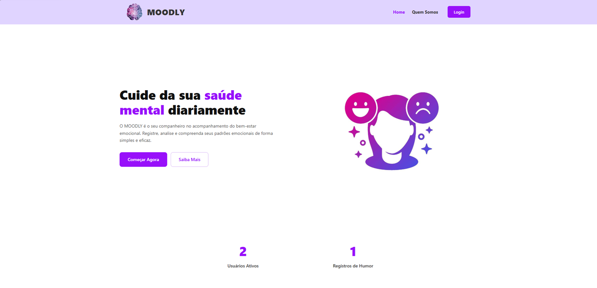
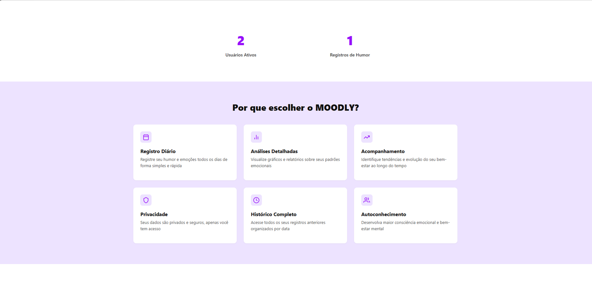
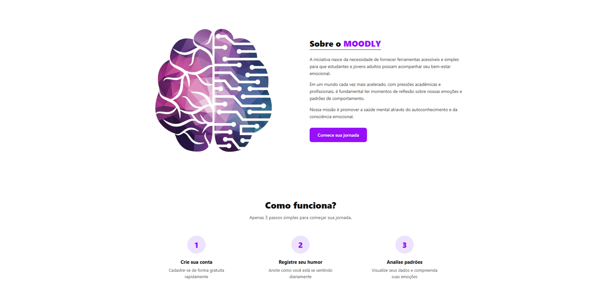
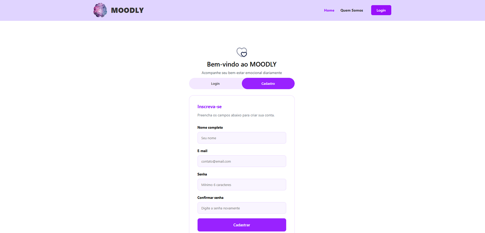
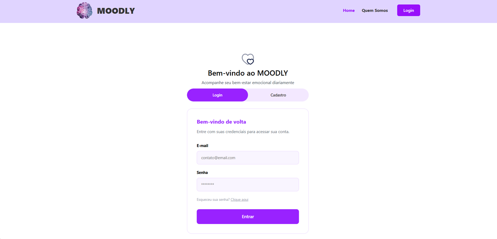
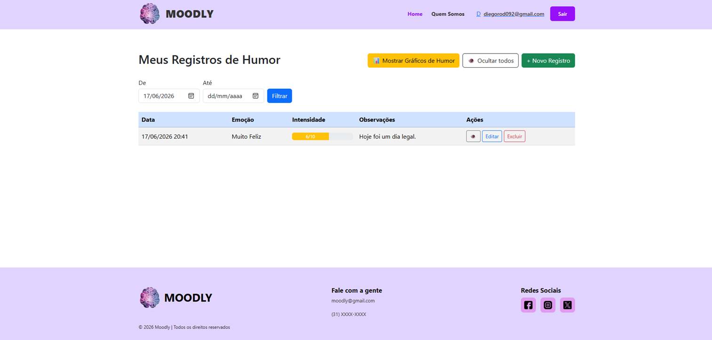
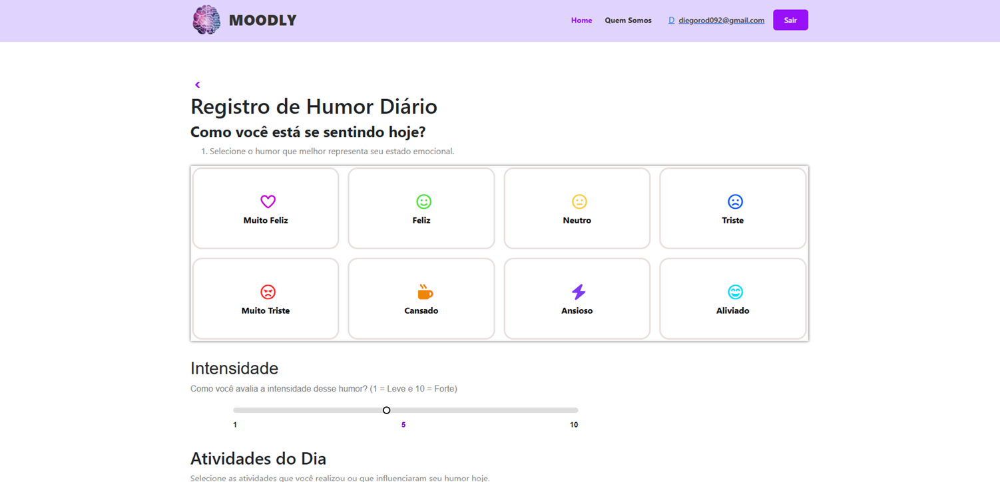
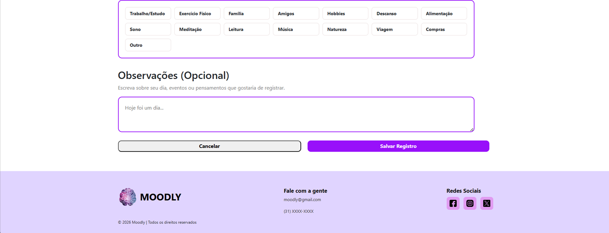
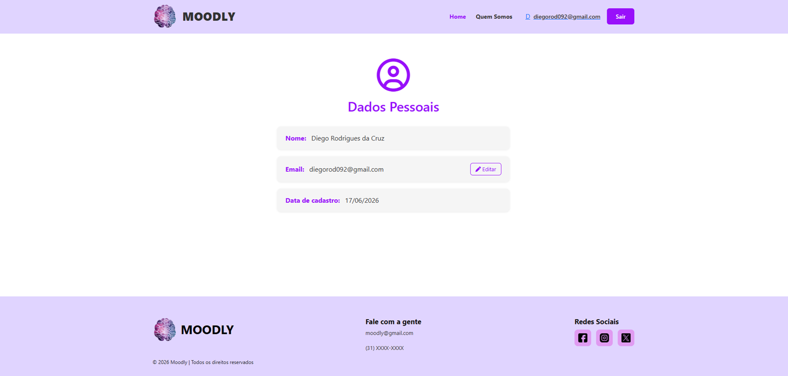
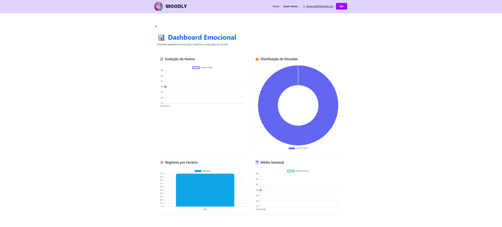

# 5. Interface do Sistema

## 5.1. Galeria de Telas (Por Sprint)

**🟢 Sprint 1: Tela Inicial**
* **Funcionalidade:** Informar sobre como o sistema funciona.
* **Descrição:** Essa tela é responsável por descrever o que o sistema faz, informar quantos usuários utilizam o sistema e o motivo da criação do sistema.

**🟡 Sprint 2: MVP (Primeira Fatia Vertical)**
* **Funcionalidade:** Cadastro de Usuários
* **Descrição:** Realizar o cadastro dos usuários que irão utilizar o sistema.

* **Funcionalidade:** Login
* **Descrição:** O usuário coloca o e-mail e a senha que eles cadastram no sistema e são redirecionados para outra tela.

* **Funcionalidade:** Meus Registros de Humor
* **Descrição:** Essa tela é responsável por mostrar os registros de humor que o usuário fez, podendo filtrar por data.

* **Funcionalidade:** Registro de Humor Diário 
* **Descrição:** É responsável pelo registro de humor do usuário no dia, ele seleciona o estado emocional, a intensidade e as atividades que ele realizou durante o dia.

**🔵 Sprint 3: Core (Regras de Negócio)**
* **Funcionalidade:** Editar Dados Pessoais
* **Descrição:** O usuário é direcionado para essa página quando clica em cima do e-mail, nessa página ele pode alterar o seu e-mail.

* **Funcionalidade:** Dashboard Emocional
* **Descrição:** Responsável pelos gráficos Evolução do Humor, Distribuição de Emoções, Registro por Horário e Média Semanal, assim o usuário tem fácil visualização de como pode está seu humor ultimamente.

